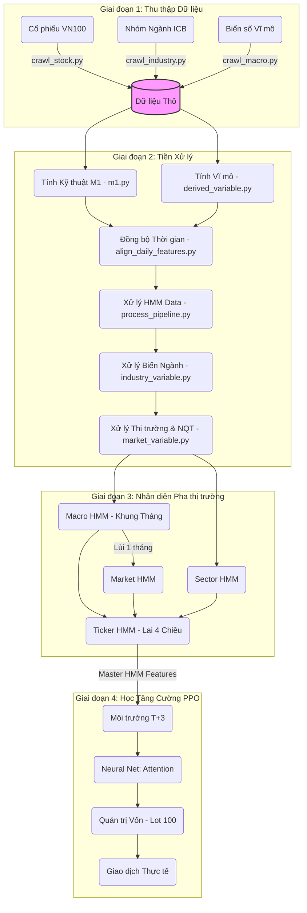

# Flow Pipeline

# Khái quát Hệ thống (AI Quantum Pipeline)

Dự án **AI Quantum** là một cỗ máy giao dịch định lượng hoàn toàn tự động, được thiết kế chuyên biệt cho thị trường Chứng khoán Việt Nam (VN100). Hệ thống vận hành qua 4 giai đoạn nối tiếp nhau (Pipeline):

---

## 1. Thu thập Dữ liệu

- **Thời gian dữ liệu:** `2016-11-10` đến `2026-07-28`
- **Nguồn dữ liệu:** `vnstock`
- **Tệp thu thập dữ liệu:**
  - `ai_core\crawl\crawl_macro.py`
  - `ai_core\crawl\crawl_stock.py`
  - `ai_core\crawl\crawl_industry.py`

### 1.1. Thu thập dữ liệu Cổ phiếu (`crawl_stock.py`)
Mô-đun cào dữ liệu cổ phiếu được tạo nhằm thu thập dữ liệu của các mã cổ phiếu trong nhóm **VN100** và đảm bảo các điều kiện sau:
- Phải có mặt trên thị trường từ `2016-11-10` trở về trước.
- Phải có tối thiểu `2300` phiên giao dịch.
- Những cổ phiếu "tuổi đời non trẻ" hoặc niêm yết muộn sẽ bị loại bỏ để đảm bảo số lượng dữ liệu đầy đủ.

> **Kết quả:** Các mã cổ phiếu được chọn sau khi đã đảm bảo ràng buộc dữ liệu: 60 mã.
> **Chi tiết:** `ai_core\success_tickers.txt`

### 1.2. Thu thập dữ liệu Ngành (`crawl_industry.py`)
Mô-đun cào dữ liệu ngành sử dụng danh sách các mã đã thông qua ràng buộc dữ liệu cổ phiếu và thực hiện các bước sau:
- Thực hiện phân loại nhóm ngành cấp theo chuẩn ICB.
- Gộp các mã cổ phiếu có chung nhóm ngành lại với nhau để tạo ra một thị trường ngành tương ứng.

### 1.3. Thu thập dữ liệu Vĩ mô (`crawl_macro.py`)

Dưới đây là danh sách các biến vĩ mô (Macro Features) được sử dụng:

| Mã | Tên biến | Mô tả |
| :---: | :--- | :--- |
| **M2** | VIX | CBOE Volatility Index |
| **M3** | S&P 500 Log Return | Lợi nhuận logarit theo ngày của chỉ số S&P 500 |
| **M4** | Foreign Net Buy/Sell | Dòng vốn mua/bán ròng của nhà đầu tư nước ngoài |
| **M5** | HOSE Trading Volume | Khối lượng giao dịch toàn sàn HOSE |
| **E1** | USD/VND Exchange Rate | Tỷ giá hối đoái USD/VND |
| **E2** | VNIBOR Overnight | Lãi suất liên ngân hàng qua đêm |
| **E3** | Vietnam Government Bond Yield (5Y) | Lợi suất trái phiếu Chính phủ Việt Nam kỳ hạn 5 năm |
| **E4** | Economic Policy Uncertainty (EPU) | Chỉ số bất định chính sách kinh tế |
| **E5** | Geopolitical Risk Index (GPR) | Chỉ số rủi ro địa chính trị |
| **E6** | Vietnam M2 Money Supply | Cung tiền M2 của Việt Nam |
| **E7** | Vietnam Credit Growth | Tăng trưởng tín dụng tại Việt Nam |
| **E8** | Vietnam CPI | Chỉ số giá tiêu dùng (lạm phát) của Việt Nam |
| **S1** | Brent Crude Oil Price | Giá dầu Brent |
| **S2** | Gold Price | Giá vàng |
| **S3** | Vietnam PMI | Chỉ số Nhà quản trị Mua hàng (Manufacturing PMI) |
| **S4** | Copper Price | Giá đồng ("Dr. Copper") |
| **C1** | Amihud Illiquidity Ratio | Chỉ số đo lường tính thanh khoản Amihud (ILLIQ) |
| **C2** | Return Dispersion | Độ phân tán lợi nhuận (Độ lệch chuẩn theo mặt cắt ngang) |
| **G1** | US Dollar Index (DXY) | Chỉ số sức mạnh đồng USD |
| **G2** | Federal Funds Rate | Lãi suất điều hành của Cục Dự trữ Liên bang Mỹ (Fed) |
| **G3** | US 10-Year Treasury Yield | Lợi suất trái phiếu Kho bạc Mỹ kỳ hạn 10 năm |
| **G4** | Shanghai SSE Composite Index | Chỉ số chứng khoán Thượng Hải (SSE Composite) |
| **G5** | Vietnam FDI | Vốn đầu tư trực tiếp nước ngoài (FDI) vào Việt Nam |

## 2. Xử lý Dữ liệu 

Quy trình xử lý dữ liệu được thực thi tự động và tuần tự thông qua `pipeline.py`. Dưới đây là chi tiết từng bước:

### 2.1 Xử lý Dữ liệu Cổ phiếu (`m1.py`)
Đối với dữ liệu của các mã cổ phiếu thực hiện việc tính toán các chỉ số: 
| Biến | Nhóm | Ý nghĩa |
|------|------|----------|
| `log_return` | Return | Lợi nhuận logarit giữa hai phiên liên tiếp |
| `rolling_vol_20d` | Volatility | Độ biến động của lợi nhuận trong 20 ngày |
| `return_5d` | Momentum | Tỷ suất sinh lời trong 5 ngày gần nhất |
| `return_20d` | Momentum | Tỷ suất sinh lời trong 20 ngày gần nhất |
| `volume_ratio` | Liquidity | Tỷ lệ giữa khối lượng hiện tại và khối lượng trung bình 20 ngày |
| `og_return` | Return | Tỷ suất sinh lời thông thường (Simple Return) |

### 2.2 Ánh xạ Dữ liệu Vĩ mô (`mapping_macro.py`)
Sao chép và đổi tên các file dữ liệu thô từ thư mục `macro` sang `processed` theo chuẩn định danh (prefix) phân loại (như `c1_`, `m2_`, `e1_`) để hệ thống dễ dàng nhận diện và xử lý hàng loạt.

### 2.3 Tính toán Biến Vĩ mô (`derived_variable.py`)
Đối với dữ liệu vĩ mô, các biến được tính toán và xử lý như sau:

| Biến | Nhóm | Ý nghĩa |
|------|------|----------|
| `close_vix`, `high_vix`, `low_vix`, `open_vix` | Return | Lợi nhuận logarit của chỉ số VIX |
| `log_return` | Return | Lợi nhuận logarit giữa hai phiên liên tiếp (S&P 500) |
| `rolling_vol_5` | Volatility | Độ biến động của lợi nhuận trong 5 ngày (S&P 500) |
| `fnb_ratio` | Ratio | Tỷ lệ dòng vốn Mua/Bán ròng của khối ngoại |
| `volume_ratio` | Liquidity | Tỷ lệ khối lượng giao dịch hiện tại so với trung bình 20 ngày |
| `volume_z20` | Liquidity | Điểm Z-score khối lượng giao dịch 20 ngày |
| `fx_log_ret` | Return | Lợi nhuận logarit tỷ giá hối đoái USD/VND |
| `interbank_on_diff` | Difference | Mức thay đổi lãi suất liên ngân hàng qua đêm |
| `vn5y_yield_diff` | Difference | Mức thay đổi lợi suất trái phiếu CP Việt Nam 5 năm |
| `epu_log` | Log | Logarit tự nhiên của chỉ số bất định chính sách kinh tế (EPU) |
| `gpr_log` | Log | Logarit tự nhiên của chỉ số rủi ro địa chính trị (GPR) |
| `m2_growth_yoy_diff` | Difference | Mức thay đổi tăng trưởng cung tiền M2 (YoY) |
| `credit_growth_yoy_diff` | Difference | Mức thay đổi tăng trưởng tín dụng (YoY) |
| `cpi_yoy` | Ratio | Tỷ lệ lạm phát CPI (YoY) |
| `cpi_mom_diff` | Difference | Mức thay đổi CPI so với tháng trước (MoM) |
| `oil_ret_5d` | Momentum | Tỷ suất sinh lời logarit giá dầu Brent trong 5 ngày |
| `gold_ret` | Return | Lợi nhuận logarit giá vàng |
| `pmi_vn_above50` | Indicator | Cờ hiệu cho biết PMI Việt Nam > 50 (Mở rộng) hay không |
| `copper_ret_5d` | Momentum | Tỷ suất sinh lời logarit giá đồng trong 5 ngày |
| `amihud_diff` | Difference | Mức thay đổi tỷ lệ thanh khoản Amihud |
| `ret_disp` | Dispersion | Độ phân tán lợi nhuận (Return Dispersion) đã được làm mượt |
| `dxy_ret` | Return | Lợi nhuận logarit chỉ số sức mạnh đồng USD (DXY) |
| `fed_rate_diff` | Difference | Mức thay đổi lãi suất điều hành của Fed |
| `us10y_diff` | Difference | Mức thay đổi lợi suất trái phiếu Mỹ 10 năm |
| `china_ret_5d` | Momentum | Tỷ suất sinh lời logarit chứng khoán Thượng Hải trong 5 ngày |
| `fdi_realized_yoy` | Ratio | Tỷ lệ tăng trưởng FDI thực hiện (YoY) |

### 2.4 Đồng bộ Dữ liệu Cổ phiếu và Vĩ mô (`align_daily_features.py`)
Do thị trường chứng khoán Việt Nam có lịch nghỉ lễ/Tết riêng biệt và dữ liệu vĩ mô đến từ nhiều nguồn với các tần suất khác nhau, cần một bước đồng bộ thời gian khắt khe:
- **Lấy Master Date Grid:** Sử dụng lịch ngày giao dịch thực tế của chứng khoán Việt Nam (rút xuất từ `m1_vn60.csv`) làm trục thời gian chuẩn (Master Dates).
- **Reindex và Forward-Fill:** Ép toàn bộ dữ liệu vĩ mô khớp vào khung thời gian Master Dates.
- **Phòng chống Rò rỉ Tương lai (No Look-Ahead Bias):** Hệ thống bắt buộc dùng phương pháp `ffill()` (mang dữ liệu quá khứ gần nhất sang), tuyệt đối không nội suy hoặc lấy dữ liệu tương lai điền ngược lại.

### 2.5 Chuẩn hóa Định dạng Thời gian (`slit_date.py`)
- **Đồng nhất định dạng cột:** Đưa mọi biến thể (`Date`, `date`, `observation_date`) về cột `time` định dạng datetime.
- **Lọc dữ liệu thô:** Chỉ giữ lại dữ liệu từ tháng 10/2016 nhằm chừa đủ không gian trễ (buffer) cho các phép tính toán trung bình trượt và loại bỏ dữ liệu quá cũ.

### 2.6 Tổng hợp & Tiền xử lý HMM (`process_pipeline.py`)
Bước này ghép nối dữ liệu đa tần suất (Daily và Monthly):
- **Tính toán bổ sung:** Tính tốc độ tăng trưởng CPI và Tín dụng (MoM difference).
- **Ghép dữ liệu (Merge As-of Backward):** Kết dính tập Monthly vào tập Daily một cách an toàn (chỉ lấy dữ liệu tháng đã được công bố tại thời điểm giao dịch tương ứng).
- **Làm mịn & Chuẩn hóa:** Áp dụng phương pháp kẹp biên (Winsorization) 1% và 99% để triệt tiêu nhiễu ngoại lai (outliers), sau đó chuẩn hóa Z-score toàn bộ dữ liệu. Kết quả lưu tại `hmm_data.csv`.

### 2.7 Tổng hợp Biến Ngành & Chuẩn hóa (`industry_variable.py`)
AI cần nhận biết dòng tiền đang chảy vào nhóm ngành nào.
- **Phân bổ Ngành:** Gán nhãn Ngành cấp 1 (chuẩn ICB) từ `icb_mapping.json`.
- **Tính toán Feature Ngành:** Tính lợi nhuận trung bình (`sector_log_ret`), tổng khối lượng, và độ biến động ngành.
- **Chuẩn hóa (Normalization):** Dùng kỹ thuật NQT (`normalize_sector`) để ép biến ngành về phân phối chuẩn. Kết quả lưu tại `industry_features.csv`.

### 2.8 Tổng hợp Biến Thị trường & Chuẩn hóa (`market_variable.py`)
Bước cuối cùng nhằm hợp nhất dữ liệu và đưa về không gian vector chuẩn:
- **Tạo Market Proxy:** Dùng trung bình trọng số của rổ VN100 (`m1_vn60.csv`) để làm chỉ số đại diện (`vnindex_log_ret`, `vnindex_close`, `vnindex_vol20`).
- **Gộp Dữ liệu:** Kết dính Market Proxy với dòng vốn khối ngoại (`fnb_ratio`) và tỷ giá (`fx_log_ret`).
- **Chuẩn hóa (Normalization):** Áp dụng kỹ thuật NQT để ép phân phối về chuẩn Gauss (Z-score). Điều này ngăn chặn mô hình AI bị thiên lệch bởi độ lớn của các con số.
- **Kết quả đầu ra:** Tệp tổng hợp hoàn chỉnh `final_model_data.csv` sẵn sàng đưa vào luồng AI.

## 3. Mô hình Nhận diện Trạng thái (Regime Detection - HMM)

Mô hình Nhận diện Trạng thái thị trường được thực thi qua `hmm.py`. Hệ thống sử dụng kiến trúc phân cấp (Hierarchical Hidden Markov Model) kết hợp với Gaussian Mixture Model (GMMHMM) nhằm phân tích từ Vĩ mô đến Vi mô. Mô-đun này hỗ trợ 2 chế độ: `--mode train` (huấn luyện từ đầu) và `--mode predict` (sử dụng `.pkl` đã lưu để infer siêu tốc).

### 3.1 Bộ lọc Đặc trưng (Feature Selection)
Trước khi đưa vào HMM, hệ thống tự động tìm kiếm các đặc trưng (features) mạnh nhất:
- **Kiểm định Kỹ thuật (Stationarity & Kurtosis):** Chạy kiểm định thống kê ADF (`p_adf` < 0.05) và KPSS để đảm bảo dữ liệu có tính dừng (stationary), ngăn ngừa HMM bị đánh lừa bởi xu hướng dài hạn.
- **Tạo Y_proxy Rule-based:** Tạo nhãn Market Regime tạm thời làm mục tiêu huấn luyện:
  - `0` (Bull / Low Vol): Lợi nhuận > 0 và Vol < Trung vị Vol.
  - `1` (Bear / High Vol): Lợi nhuận < 0 và Vol > Trung vị Vol.
  - `2` (Sideways): Các trường hợp còn lại.
- **Tính điểm Quan trọng Kép (SHAP + MI):** 
  - Dùng thuật toán `LightGBM` phân loại `Y_proxy` để tính độ quan trọng trung bình (`shap_importance`).
  - Dùng `mutual_info_regression` đo lường mức độ phụ thuộc phi tuyến giữa các biến và giá trị tuyệt đối của lợi nhuận (`|vnindex_log_ret|`).
  - Tổng hợp điểm: `total_score = shap_importance * mi_score`.
- **Lọc VIF Tham lam (Greedy VIF):** Xếp hạng biến theo `total_score` từ cao xuống thấp và loại trừ dần các biến gây đa cộng tuyến (Multicollinearity).

### 3.2 Huấn luyện Macro HMM (Vĩ mô - Khung Tháng)
- **Chuẩn bị:** Chuyển dữ liệu vĩ mô về khung tháng (lấy giá trị ngày cuối tháng). Dữ liệu huấn luyện chốt đến `2019-12-31`.
- **Grid Search:** Dò tìm cấu hình số trạng thái (K=2, 3) tối ưu nhất bằng GMMHMM. 
- **Đánh giá (Evaluation):** Tính điểm tổng hợp (Composite Score) với trọng số: `0.5 * Rank(BIC) + 0.5 * Rank(Out-Of-Sample Log-Likelihood)`.
- **Xử lý trễ công bố (Publication Lag):** Toàn bộ xác suất trạng thái vĩ mô (`Macro_Prob_{k}`) sau khi dự báo sẽ được **dịch lùi (shift) 1 tháng** trước khi nối (merge) vào dữ liệu ngày (Daily). Điều này bảo đảm AI không "nhìn trước" (Look-Ahead Bias) dữ liệu vĩ mô chưa được Tổng Cục Thống Kê công bố tại thời điểm thực tế.

### 3.3 Huấn luyện Market HMM (Thị trường chung - Khung Ngày)
- **Đầu vào lai (Hybrid):** Kết hợp các Market Features mạnh nhất cùng Xác suất Vĩ mô (Macro Probs) từ bước 3.2.
- **Grid Search:** Dò tìm (K=2, 3, 4). Tiêu chí tổng hợp phức tạp hơn: `0.3 * Rank_BIC + 0.5 * Rank_OOS_LL + 0.2 * Rank_Min_Duration`.
- **Gán nhãn tự động (K-agnostic Auto-labeling):** Dựa vào thống kê lợi nhuận trung bình và biến động (volatility) của từng Regime $k$, hệ thống tự động gọi tên bản chất của trạng thái đó (Bull, Bear, Sideways) mà không cần con người can thiệp.

### 3.4 Huấn luyện Sector HMM (Nhóm Ngành)
- Khởi tạo độc lập một mô hình HMM cho từng nhóm ngành cấp 1 (ICB).
- **Khử nhiễu cục bộ:** Bơm một lượng nhiễu Gaussian cực nhỏ (`1e-4`) vào chuỗi ma trận Z-score của ngành để tránh lỗi ma trận suy biến (Singular Matrix) khi chạy GMM.
- **Điều kiện khắt khe:** Yêu cầu mô hình phải có độ bền trạng thái tối thiểu (`min_dur >= 3.0` ngày), nếu không sẽ bị loại.
- Kết quả trả về là xác suất dòng tiền theo hướng ngữ nghĩa (`prob_sector_Bull`, `prob_sector_Bear`).

### 3.5 Huấn luyện Ticker HMM (Cổ phiếu cụ thể)
- **Ghép nối Không gian 4 Chiều:** Mô hình lấy ma trận bao gồm: (1) Đặc trưng kỹ thuật riêng của cổ phiếu + (2) Xác suất Macro + (3) Xác suất Market + (4) Xác suất Sector.
- **Làm mịn Z-score cục bộ:** Các chuỗi lai (Hybrid) được tính trượt Z-score (`make_Z_ticker`) với khung 252 ngày để ổn định đường cơ sở.
- Cố định số trạng thái `K=3` (tương ứng 3 pha điển hình của cổ phiếu) chạy qua mô hình `GMMHMM(n_mix=2)`.
- **Đầu ra:** File `master_ticker_hmm_results.csv` chứa nhãn Regime và các xác suất (Probabilities) của mọi mã VN100 mỗi ngày, đóng vai trò là "Giác quan Môi trường" (Environment Context) cho thuật toán PPO Reinforcement Learning.

---

## 4. Quyết định Hành động (Reinforcement Learning - PPO)

Trái tim của hệ thống giao dịch tự động nằm tại module `ppo.py`. Tại đây, thuật toán Proximal Policy Optimization (PPO) sẽ học cách giao dịch trong một môi trường giả lập khắt khe được tinh chỉnh riêng cho chứng khoán Việt Nam.

### 4.1 Môi trường Giả lập (Gym Environment: AdvancedPortfolioEnv)
AI phải sinh tồn trong môi trường `AdvancedPortfolioEnv` tích hợp các bộ luật tài chính và quy định khắt khe được cài đặt trong `CONFIG`:
- **Khóa hàng T+3 (Settlement Lock):** Sử dụng cấu trúc hàng đợi (FIFO queue) qua mảng `locked_weights` (hàng chưa về) và `weight_unlocked` (hàng có sẵn). Nếu AI cố tình xuất lệnh Bán vượt quá số lượng cổ phiếu đã được "mở khóa", hệ thống sẽ ép buộc cắt tỉa lệnh bán: `action = np.maximum(action, self.weights - max_sell)`.
- **Phí giao dịch (Transaction Fee):** `COST_RATE = 0.001` (Tương đương 0.1% mỗi chiều, thuế phí thực tế ở VN khoảng 0.25% - 0.4% vòng quay).
- **Phạt Giao dịch Quá mức (Turnover Penalty):** `TURNOVER_PENALTY_RATE = 0.3`. Ngăn chặn AI giao dịch liên tục (churning) để bào mòn phí.
- **Phạt Phân bổ Quá mức (Over-diversification):** `PENALTY_OVER_DIVERSIFICATION = 0.01`. Ngăn chặn việc mua mỗi mã một ít như "tạp hóa" (quá 20 mã).
- **Phân bổ vốn (Entropy Coefficient):** Định tuyến bằng hằng số `ENT_COEF = 0.025`. Mức cấu hình này buộc AI phải cân bằng giữa việc "All-in" vào 1-2 mã và phân tán vốn rủi ro.
- **Quy đổi Lô Chẵn (Lot Size):** Trước khi xuất lệnh, tỷ trọng đầu tư được ánh xạ qua hàm `allocate_portfolio_real()` để chia đều số vốn thực (VD: 100 triệu) thành các lệnh mua theo bội số 100 cổ phiếu.

### 4.2 Thiết kế Kiến trúc Mạng (Neural Network: AdvancedTickerExtractor)
Bộ não của AI sử dụng mạng Nơ-ron tùy chỉnh cực sâu để xử lý ma trận không gian quan sát (Observation Space) gồm 60 mã cổ phiếu x 11 đặc trưng (Features):
- **Tầng 1 (Local - Dense):** Phân tích tín hiệu độc lập của từng mã thông qua 2 lớp Linear Dense (11 $\rightarrow$ 32 $\rightarrow$ 16 node) đi kèm hàm kích hoạt ReLU.
- **Tầng 1.5 (Cross-Ticker Attention):** Ứng dụng **Multihead Attention** (4 heads, embed_dim=16). Mạng cho phép 60 cổ phiếu "giao tiếp", "nhìn" nhau để so sánh sức mạnh (Relative Strength) chéo nhằm tự bầu chọn ra mã "Leader" dẫn dắt dòng tiền. Để chống hiện tượng nổ đạo hàm (Exploding Gradients) gây tràn bộ nhớ, hệ thống ép buộc phải dùng `LayerNorm` kết hợp Residual Connection: `layer_norm(features + attn_out)`.
- **Tầng 2 (Global):** Trải phẳng ma trận (Flatten) và đưa ra quyết định Action (Mảng phân bổ trọng số danh mục) thông qua mạng Linear tuyến tính.

### 4.3 Giáo trình Đào tạo (Curriculum & Continual Learning)
Hệ thống sử dụng bộ tham số tiêu chuẩn của PPO (`N_STEPS = 1024`, `LEARNING_RATE = 0.00005`, `BATCH_SIZE = 64`) để tối ưu hóa Policy. Tuy nhiên, luồng huấn luyện được chia làm 2 tùy chọn độc đáo:
- **Chế độ Học Cố định (Fast Split):** Cắt nhanh tập dữ liệu (80% Train, 10% Val, 10% Test) dùng cho việc thử nghiệm chiến thuật nhanh.
- **Chế độ Học Cuốn chiếu (Rolling Window):** Mô phỏng lại cách quỹ giao dịch ngoài thực tế (Train 252 ngày, Trade 21 ngày). Hệ thống áp dụng **Continual Learning**, nạp lại bộ nhớ (weights) của chu kỳ trước và học tiếp chứ không học lại từ đầu (`model.set_env()`), giúp mô hình thích nghi liên tục với điều kiện vĩ mô thay đổi.
- **Giáo trình Nâng dần độ khó (Curriculum):** Thay vì ném AI thẳng vào môi trường T+3 khó nhằn, hệ thống huấn luyện nâng dần:
  1. Học T+0 (1 triệu steps): AI mua bán tức thì, hiểu khái niệm cắt lỗ/chốt lời.
  2. Học T+1 (1 triệu steps): Bắt đầu làm quen với độ trễ 1 ngày.
  3. Học T+3 (3 triệu steps cuối): Ép khuôn vào luật khắc nghiệt nhất.

### 4.4 Hệ thống Khen thưởng / Trừng phạt (Reward Design)
Hệ thống tính điểm (Reward) quyết định 100% "nhân cách" của AI. Để rèn luyện một AI giao dịch an toàn và có tính phòng thủ cao, luật chơi được định nghĩa cụ thể bằng các công thức:
- **Điểm cơ sở (Base Reward):** Bằng đúng tỷ suất sinh lời ròng của ngày hôm đó nhân với 100. *(Ví dụ: Lãi 2% $\rightarrow$ Thưởng $+2$ điểm).*
- **Phạt bất đối xứng (Asymmetric Penalty):** Nếu ngày đó lỗ (Return < 0), điểm cơ sở sẽ bị nhân lên **gấp 5 lần**. *(Ví dụ: Lỗ 2% $\rightarrow$ Phạt $-10$ điểm)*. Cơ chế "sợ lỗ hơn thích lãi" này ép AI phải tránh xa các cổ phiếu cờ bạc, biến động ảo.
- **Phạt Sụt giảm Tài sản (Drawdown Penalty):** Hệ thống liên tục đo lường mức sụt giảm (Drawdown) từ mức đỉnh tài sản (Peak NAV). Bất cứ khi nào Drawdown tiếp tục sâu hơn so với ngày hôm qua, AI sẽ bị trừ thẳng điểm: `Reward -= (Mức sụt giảm tăng thêm * 3000)`.
- **Game Over (Ngưỡng Cháy Tài khoản):** Nếu tổng mức sụt giảm (Drawdown) chạm mốc **30%**, hệ thống lập tức trừ **5000 điểm**, đồng thời "cưỡng chế ngắt cầu dao" (Force Terminate) kết thúc phiên học ngay lập tức vì AI đã vi phạm quy tắc bảo toàn vốn sống còn.

### 4.5 Siêu Tham Số & Đánh Giá (Optuna & Leaderboard)
- Toàn bộ quá trình chọn giống (Random Seed từ 1-10000) và điều chỉnh siêu tham số được tự động hóa bằng hệ thống `Optuna`.
- Sau khi kiểm thử (Backtest) thành công trên tập Test Set, kết quả được xuất tự động ra file lưu trữ thành tựu trung tâm `training_leaderboard.csv` theo dạng metadata (bao gồm: Phiên bản, Random Seed, Profit %, Tham số...). Model xuất ra sẽ được đặt tên tự động theo format: `AI_Brain_v9_Seed42_Profit_51.27.zip`.

### 4.6 Tập Dữ Liệu Huấn Luyện (AI Features - Đã qua NQT)
Dữ liệu mà mạng Nơ-ron (PPO) trực tiếp sử dụng để học. Toàn bộ các đặc trưng này đã được chuẩn hóa chéo (Cross-Sectional Normalization) bằng thuật toán **NQT (Normal Quantile Transformation)** để đưa về phân phối chuẩn, giúp AI dễ học hơn.

| Nhóm Tính năng | Đặc trưng (Features) | Ý nghĩa |
|---|---|---|
| **HMM Core** | `prob0`, `prob1`, `prob2` | Xác suất của 3 trạng thái thị trường (Regimes) |
| **HMM Core** | `vol_20d`, `ret_20d`, `vol_ratio` | Khối lượng, lợi nhuận, tỷ lệ thanh khoản từ HMM |
| **Momentum** | `dist_ma20`, `momentum_3d` | Độ lệch so với MA20, động lượng giá T+3 |
| **Thị trường** | `mkt_ret5`, `mkt_ret20`, `mkt_vol` | Hiệu suất và biến động của toàn thị trường VNINDEX |
| **Vĩ mô (Ngày)** | `fnb_ratio`, `vix`, `dxy` | Giao dịch khối ngoại, chỉ số sợ hãi VIX, chỉ số sức mạnh USD |
| **Vĩ mô (Tháng)** | `cpi_yoy`, `m2_growth_yoy`, `pmi_vn` | Lạm phát, Cung tiền M2, Chỉ số sản xuất PMI *(Đã shift trễ 30 ngày để chống Lookahead Bias)* |
| **Chiến lược** | *33 Tính năng Kỹ thuật* | Toàn bộ 33 tín hiệu kỹ thuật (Bảng 4.7) được NQT hóa và nhồi thêm vào AI |

> **Lưu ý về Phiên bản Dữ liệu (Macro Mode):** 
> - Đối với mô hình **V9 (AI_Brain_v9)**, hệ thống sử dụng toàn bộ **50 Đặc trưng** như bảng trên. 
> - Đối với các phiên bản AI cũ (V8 trở xuống), hệ thống tự động tương thích ngược, chỉ nạp **44 Dữ liệu cũ** (bỏ qua các biến vĩ mô mới như CPI, M2, PMI).

### 4.7 Tập Dữ Liệu Giám Sát (Strategy Features - Giá trị thô)
Đây là tập dữ liệu nguyên bản (không chuẩn hóa NQT) **KHÔNG ĐƯA CHO AI HỌC**. Nó chỉ được hệ thống rule-based sử dụng nội bộ để giám sát rủi ro, log các điểm Mua/Bán (🟢/🔥), và hiển thị biểu đồ. Bao gồm 33 tín hiệu kinh điển:

| Nhóm | Biến đại diện (Variables) | Ý nghĩa |
|---|---|---|
| **Cơ bản** | `vol`, `low`, `close` | Giá thấp nhất, đóng cửa, khối lượng |
| **Trung bình động** | `ema_20`, `ema_50`, `ema_200` | Đường trung bình mũ dài/ngắn hạn |
| **Bollinger Bands** | `bb_lower`, `bb_middle`, `bb_upper`, `bb_expanding` | Dải băng dưới/giữa/trên và cờ báo hiệu nổ Vol |
| **Dao động kế** | `rsi`, `macd`, `hist` | Chỉ báo sức mạnh tương đối và MACD |
| **Hành vi Giá (PA)** | `is_hammer`, `is_bull_engulf` | Nến búa, nến nhấn chìm tăng |
| **Cấu trúc Sóng** | `lowest_low_5`, `highest_high_20`, `sup`, `res` | Đáy thấp nhất, đỉnh cao nhất, Hỗ trợ / Kháng cự (Đỉnh/đáy 41 ngày) |
| **Fibonacci** | `fib_382`, `fib_500`, `fib_618`, `fib_ext_127` | Các mốc thoái lui và mở rộng của con sóng cuối |
| **Trạng thái** | `is_upward_wave`, `is_accumulation` | Đang trong sóng tăng hay Hộp tích lũy (biên độ < 15%) |
